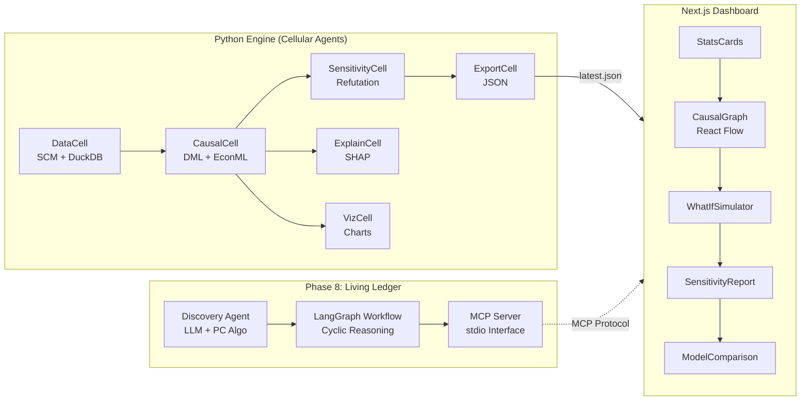

# WhyLab: Causal Inference Engine for Fintech


> **"Data with Why"**  
> AI가 상관관계와 인과관계를 분리하고, **액션 가능한 인사이트를 자동으로 생성**하는 의사결정 지원 플랫폼.
> DML 기반 인과추론 엔진 + 인터랙티브 대시보드 + 자율 에이전트 아키텍처.

---

## 🔍 Project Overview

데이터 분석가로서 우리는 종종 **"이 정책이 정말 효과가 있었나?"**라는 질문을 받습니다. 단순히 "A를 한 유저가 B를 많이 했다"는 상관관계 분석은 위험합니다. 역인과 관계나 교란 변수(Confounder)가 숨어있기 때문입니다.

**WhyLab**은 이러한 문제를 해결하기 위해 구축되었습니다.
-   **Problem**: 관찰 데이터만으로 순수 처치 효과(ATE/CATE)를 어떻게 추정할 것인가?
-   **Solution**: **Double Machine Learning (DML)** 기법을 적용하여 교란 변수의 영향을 직교화(Orthogonalization)로 제거합니다.
-   **Output**: 신뢰할 수 있는 인과 효과 추정치와, 이를 시각적으로 탐색할 수 있는 인터랙티브 대시보드.

## 📸 Dashboard Preview


> 대시보드에서 ATE/CATE 분석 결과, 인과 그래프(DAG), 민감도 검증, What-If 시뮬레이션을 한눈에 확인할 수 있습니다.

## Architecture



## Key Features

1.  **Causal Inference Engine (Python)**
    -   **EconML & LightGBM**: DML Modeling (LinearDML, CausalForest).
    -   **DuckDB**: Large-scale data preprocessing (Window Functions).
    -   **SHAP**: Explainability.
    -   **Auto-Reporting**: Markdown report generation.

2.  **Interactive Dashboard (Next.js)**
    -   **Causal Graph (DAG)**: Causal structure visualization (React Flow).
    -   **What-If Simulator**: Real-time intervention simulation.
    -   **Sensitivity Report**: Placebo Test + Random Common Cause visualization.
    -   **Model Comparison**: AutoML candidate model RMSE comparison.

3.  **Autonomous Agent Architecture (Phase 8)**
    -   **Discovery Agent (Nucleus)**: Hybrid causal discovery (LLM + Statistical).
    -   **MCP Server (Membrane)**: Standard interface for external agent connectivity.
    -   **LangGraph Workflow (Cytoplasm)**: Stateful Discovery-Estimation-Refutation loop.
    -   **Tissue Simulation**: Multi-agent collaboration under data drift.

## 🚀 Scenarios

### Scenario A: Credit Limit Optimization
-   **Q**: "신용 한도를 상향하면 연체율이 낮아질까?"
-   **Finding**: 고신용자에게는 연체율 감소 효과가 뚜렷하지만, 저신용자에게는 효과가 없거나 부정적입니다. (비선형적 이질성 발견)

### Scenario B: Marketing Budget Allocation
-   **Q**: "누구에게 투자 쿠폰을 보내야 가입률이 가장 많이 오를까?"
-   **Finding**: 20대 사회초년생(Persuadables)의 반응률이 가장 높으며, 50대 자산가는 쿠폰 없이도 가입하거나 쿠폰에도 반응하지 않습니다.

## 🛠️ Tech Stack

| Category | Technologies |
|----------|--------------|
| **Core Engine** | Python 3.11, EconML, LightGBM, NumPy, Pandas |
| **Data Eng** | DuckDB, Scikit-learn, Apache Arrow |
| **Frontend** | Next.js 14 (App Router), TypeScript, Tailwind CSS |
| **Visualization** | Recharts, React Flow, Framer Motion |
| **Agent Framework** | LangGraph, MCP (Model Context Protocol) |
| **DevOps** | GitHub Actions |

## 📦 How to Run

### 1. Engine (Analysis)
```bash
# 환경 설정
cd engine
pip install -r requirements.txt

# 파이프라인 실행 (Scenario A) -> JSON 결과 및 리포트 생성
python -m engine.pipeline --scenario A
```

### 2. Dashboard (Visualization)
```bash
# 대시보드 실행
cd dashboard
npm install
npm run dev
# http://localhost:3000
```

### 3. Agent Workflow (LangGraph)
```bash
# Discovery-Estimation-Refutation loop
python -m experiments.tissue_simulation
```

### 4. MCP Server
```bash
# Start MCP Server (stdio mode)
python -m engine.server.mcp_server
```

## 📝 Documentation
-   [**White Paper**](paper/reports/white_paper.md): 상세 방법론 및 실험 결과 보고서.
-   [**Implementation Plan**](implementation_plan.md): 프로젝트 개발/구축 계획서.

---

## 🔮 Future Vision: The Living Ledger
> *"From Pipelines to Cellular Agents"*

**WhyLab**은 단순한 분석 도구가 아닙니다. 이는 **'살아있는 장부(The Living Ledger)'**를 향한 첫 번째 세포 분열입니다.
우리는 기계적인 데이터 파이프라인을 거부하고, 생물학적 유기체처럼 스스로 가설을 세우고(Nucleus), 검증하며(Refutation), 진화하는(Homeostasis) **세포 에이전트(Cellular Agents)** 시스템을 지향합니다.

-   [**Read the Vision Paper**](paper/visions/living_ledger.md): 핀테크 생태계를 위한 자율 인과추론 아키텍처 연구 보고서.

---

*Built with ❤️ by Yesol*
