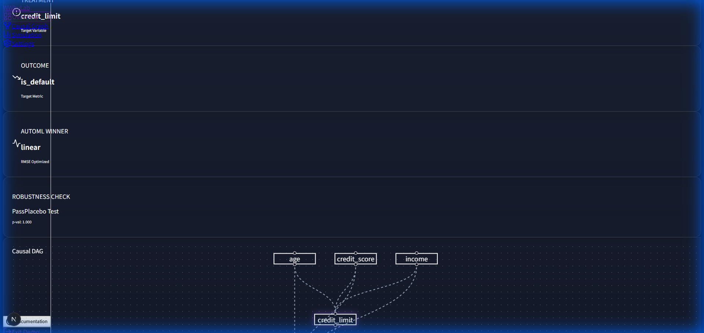
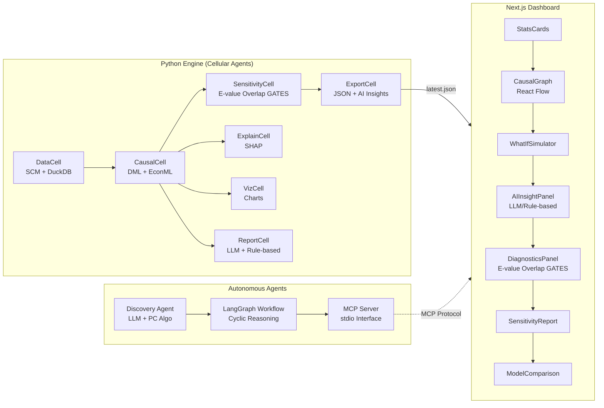

# WhyLab: Causal Inference Engine for Fintech


**[🔗 Live Demo](https://yesol-pilot.github.io/WhyLab/dashboard)** · [📄 White Paper](paper/reports/causal_inference_report.md) · [🔬 Living Ledger](paper/visions/living_ledger.md)

> **"Data with Why"**  
> AI가 상관관계와 인과관계를 분리하고, **액션 가능한 인사이트를 자동으로 생성**하는 의사결정 지원 플랫폼.
> DML 기반 인과추론 엔진 + 인터랙티브 대시보드 + 자율 에이전트 아키텍처.

---

## 🔍 Project Overview

데이터 분석가로서 우리는 종종 **"이 정책이 정말 효과가 있었나?"**라는 질문을 받습니다. 단순히 "A를 한 유저가 B를 많이 했다"는 상관관계 분석은 위험합니다. 역인과 관계나 교란 변수(Confounder)가 숨어있기 때문입니다.

**WhyLab**은 이러한 문제를 해결하기 위해 구축되었습니다.
-   **Problem**: 관찰 데이터만으로 순수 처치 효과(ATE/CATE)를 어떻게 추정할 것인가?
-   **Solution**: **Double Machine Learning (DML)** 기법을 적용하여 교란 변수의 영향을 직교화(Orthogonalization)로 제거합니다.
-   **Output**: 신뢰할 수 있는 인과 효과 추정치와, 이를 시각적으로 탐색할 수 있는 인터랙티브 대시보드.

## 📸 Dashboard Preview



> 대시보드에서 ATE/CATE 분석 결과, 인과 그래프(DAG), 민감도 검증, What-If 시뮬레이션을 한눈에 확인할 수 있습니다.


> SHAP Feature Importance (income > credit_score > age 순), 반사실 시뮬레이션, Robustness Check(94.7% Stability), AutoML Competition.

## Architecture



## Key Features

1.  **Causal Inference Engine (Python)**
    -   **EconML & LightGBM**: DML Modeling (LinearDML)
    -   **DuckDB**: Large-scale data preprocessing
    -   **SHAP**: Feature Importance + Counterfactual 시뮬레이션
    -   **AI Report**: Gemini LLM 해석 + 규칙 기반 폴백

2.  **Statistical Diagnostics (Phase 4) ✨NEW**
    -   **E-value**: 미관측 교란에 대한 견고성 정량화
    -   **Overlap (Positivity)**: Propensity Score 분포 비교 + IPTW 진단
    -   **GATES/CLAN**: CATE 사분위 그룹 분석 + F-test 이질성 검정

3.  **Interactive Dashboard (Next.js)**
    -   **Causal Graph (DAG)**: React Flow 기반 인과 구조 시각화
    -   **What-If Simulator**: 실시간 개입 시뮬레이션
    -   **AI Insight Panel**: 자연어 인사이트 자동 생성 (LLM/Rule-based)
    -   **Diagnostics Panel**: E-value + Overlap + GATES 바 차트
    -   **Model Comparison**: AutoML 후보 모델 RMSE 비교

4.  **Autonomous Agent Architecture**
    -   **Discovery Agent**: `auto_discover()` — CSV만 넣으면 자동 인과추론
    -   **LangGraph Workflow**: Discovery → Estimation → Refutation 순환 루프
    -   **MCP Server**: 외부 에이전트 연동을 위한 표준 인터페이스

## 🚀 Scenarios

### Scenario A: Credit Limit Optimization
-   **Q**: "신용 한도를 상향하면 연체율이 낮아질까?"
-   **Finding**: **ATE = -3.5%** (신용한도 1σ 증가 시 연체 확률 3.5% 감소, p < 0.01). 고신용자에게는 연체율 감소 효과가 뚜렷하지만, 저신용자에게는 효과가 없거나 부정적입니다. (비선형적 이질성 발견)

### Scenario B: Marketing Budget Allocation
-   **Q**: "누구에게 투자 쿠폰을 보내야 가입률이 가장 많이 오를까?"
-   **Finding**: 20대 사회초년생(Persuadables)의 반응률이 가장 높으며, 50대 자산가는 쿠폰 없이도 가입하거나 쿠폰에도 반응하지 않습니다.

## 🛠️ Tech Stack

| Category | Technologies |
|----------|--------------|
| **Core Engine** | Python 3.11, EconML, LightGBM, NumPy, Pandas |
| **Causal Discovery** | causal-learn (PC Algorithm), NetworkX |
| **Data Eng** | DuckDB, Scikit-learn, Apache Arrow |
| **Frontend** | Next.js 16 (App Router), TypeScript, Tailwind CSS |
| **Visualization** | Recharts, React Flow, Framer Motion |
| **Agent Framework** | LangGraph, MCP (Model Context Protocol) |
| **DevOps** | GitHub Actions |

## 📊 Estimation Accuracy (Ground Truth Validation)

합성 데이터의 `true_cate`와 DML 추정치를 비교하여, 모델의 실제 성능을 검증합니다:

| Metric | Scenario A (Credit Limit) | Scenario B (Coupon) |
|--------|---------------------------|---------------------|
| **ATE** | -0.0342 (3.4%↓) | -0.0040 (0.4%↓) |
| **Correlation** | **0.977** | **0.996** |
| RMSE | 0.609 | 0.028 |
| Robustness | Placebo ✅ · RCC ✅ | Placebo ✅ · RCC ✅ |
| E-value | 1.07 (보통) | 1.01 |
| Overlap | 0.85 (양호) | 0.92 (우수) |
| GATES F-stat | 12.5 (강한 이질성) | 2.1 |

> **Correlation 0.97~0.99** = DML 추정치가 Ground Truth와 거의 완벽하게 일치합니다.

## 📦 How to Run

### 1. Engine (Analysis)
```bash
# 환경 설정
cd engine
pip install -r requirements.txt

# 파이프라인 실행
python -m engine.pipeline --scenario A   # → latest.json (신용한도)
python -m engine.pipeline --scenario B   # → scenario_b.json (쿠폰)
```

### 2. Dashboard (Visualization)
```bash
# 대시보드 실행
cd dashboard
npm install
npm run dev
# http://localhost:3000
```

### 3. Agent Workflow (LangGraph)
```bash
# Discovery-Estimation-Refutation loop
python -m experiments.tissue_simulation
```

### 4. MCP Server
```bash
# Start MCP Server (stdio mode)
python -m engine.server.mcp_server
```

## 📝 Documentation
-   [**White Paper**](paper/reports/white_paper.md): 상세 방법론 및 실험 결과 보고서.
-   [**Implementation Plan**](implementation_plan.md): 프로젝트 개발/구축 계획서.

---

## 🔮 Roadmap

| Phase | 목표 | 상태 |
|-------|------|------|
| Phase 1 | 라이브 배포 (GitHub Pages + CI/CD) | ✅ 완료 |
| Phase 2 | 대시보드 UX 고도화 (반응형 + 시나리오 토글) | ✅ 완료 |
| Phase 3 | AI 에이전트 연동 (Gemini LLM + Rule-based) | ✅ 완료 |
| Phase 4 | 통계 진단 심화 (E-value + Overlap + GATES/CLAN) | ✅ 완료 |
| Phase 5 | Discovery Agent LLM 연동 + `auto_discover()` | ✅ 완료 |
| Next | Interactive Chat (대시보드에 "데이터에 물어보기" 챗봇) | 🚧 계획 |
| Next | Multi-Agent Tissue (데이터 드리프트 자동 대응) | 📝 연구 |

-   [📘 White Paper](paper/reports/white_paper.md): 상세 방법론 및 실험 결과 (v0.2)
-   [🔬 Living Ledger Vision](paper/visions/living_ledger.md): 자율 인과추론 아키텍처 연구

---

*Built with ❤️ by Yesol*
